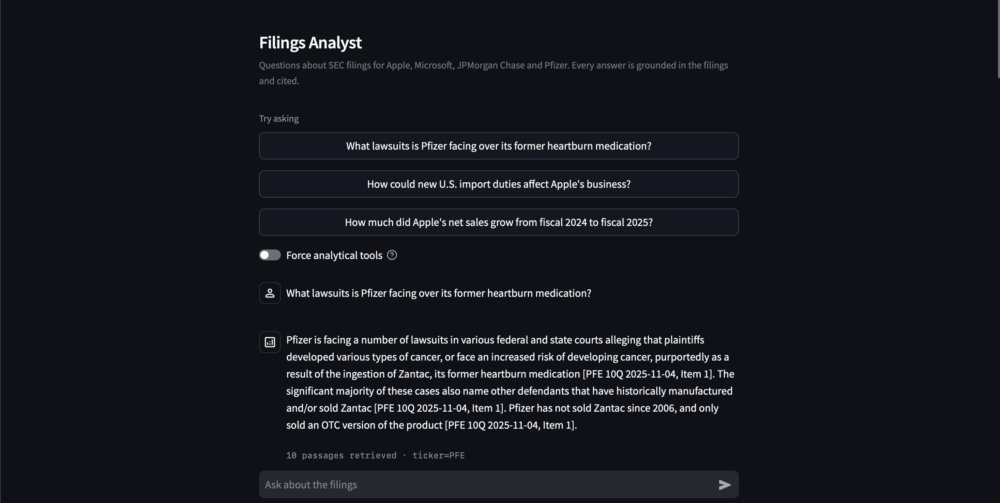
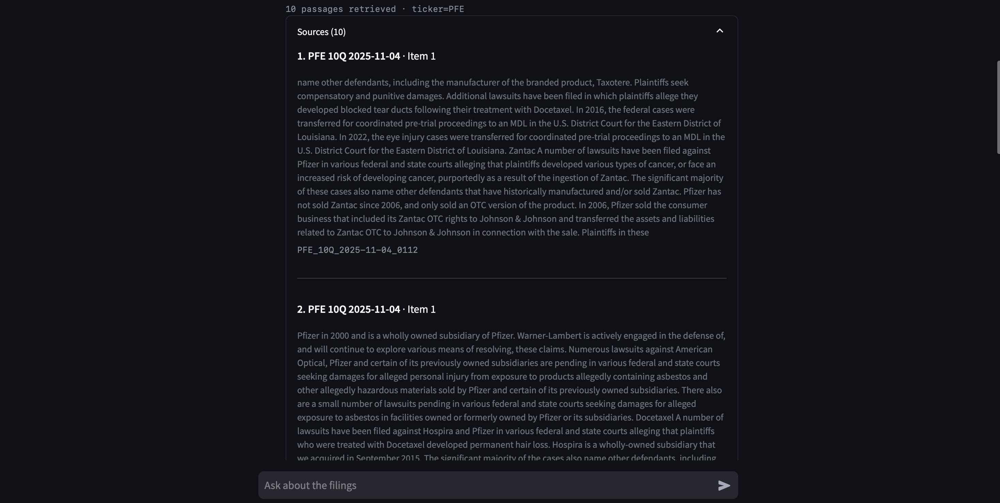

# Financial Filings RAG

> 🔗 **Live demo:** https://financial-filings-rag-rlcq58txd8kpc6p2blkajz.streamlit.app/
>
> Runs on a free-tier API key with a daily token budget. If the app
> reports the model unavailable, the quota is exhausted — the code and
> evaluation results below are unaffected.



*The question uses everyday wording ("heartburn medication"); the filings
only ever say "Zantac". Each claim carries the filing and section it
came from.*



*Every answer exposes the retrieved passages, so any claim can be checked
against the source text.*

A RAG application with agentic capabilities for querying SEC filings
(10-K / 10-Q) in natural language, with source-cited answers.

## Problem

Financial filings are long (100+ pages), dense, and written in legal
prose. Extracting a specific fact — revenue growth, identified risk
factors, segment performance — means manually digging through them.
A general-purpose LLM alone can't help reliably: it doesn't know the
latest filings, and in finance a hallucinated number is worse than no
answer.

This project answers natural-language questions over a corpus of real
SEC filings, grounding every claim in the source documents and citing
them explicitly.

## Data

**Source:** [SEC EDGAR](https://www.sec.gov/search-filings) — the SEC's
public, free filing database (no registration required).

**Corpus:** the latest 10-K (annual report) and the two latest 10-Q
(quarterly reports) for four companies chosen across different sectors:

| Ticker | Company        | Sector          |
|--------|----------------|-----------------|
| AAPL   | Apple          | Tech (hardware) |
| MSFT   | Microsoft      | Software/cloud  |
| JPM    | JPMorgan Chase | Banking         |
| PFE    | Pfizer         | Pharma          |

Sector diversity is deliberate: partially overlapping companies
(AAPL/MSFT) and clearly distinct ones let the evaluation observe
retrieval behavior in both easy and hard regimes. Multiple filing
periods per company enable year-over-year comparisons (agentic
component, Phase 4).

**Reproducibility:** raw documents are not committed. The corpus is
rebuilt from scratch by the ingestion scripts (see below). Filings are
identified deterministically (latest N per type), and chunk IDs are
stable across re-runs.

**Processing:** HTML filings are cleaned (scripts/styles stripped,
table text kept — key figures live in tables) and split into chunks of
200 words with a 40-word overlap. Chunk size is dictated by the
embedding model's 256-token input limit. Each chunk carries metadata
(ticker, form type, filing date, and the 10-K "Item" section when
detectable), which powers filtering and source citations downstream.

## Architecture

### Ingestion (offline, run once per corpus rebuild)

SEC EDGAR API
      │
      ▼
download_filings.py ──────▶ data/raw/*.html
      │
      ▼
chunk_filings.py ─────────▶ data/processed/chunks.json
      │
      ├──▶ TF-IDF index (in memory, built at startup)
      │
      └──▶ vector_search.py ──▶ data/processed/embeddings.npy

### Query path A — natural-language questions (default)

question
   │
   ▼
query_analysis.py          rules only, no LLM call
   │  infers ticker + form type
   ▼
dense search               MiniLM, k=10, hard metadata filters
   │
   ▼
prompt + context           context-only, cite each claim, refuse if absent
   │
   ▼
Groq / Llama 3.3 70B       temperature=0
   │
   ▼
answer + [TICKER FORM DATE, SECTION]

### Query path B — quantitative and comparative questions (agentic)

question
   │
   ▼
tool selection             model picks tool + parameters
   │
   ├──▶ lookup_metric(ticker, metric, period)
   │         │
   │         ▼
   │    keyword search     TF-IDF, filtered by ticker + form
   │         │
   │         ▼
   │    verbatim extraction   value + period label, quoted from source
   │         │
   │         ▼
   │    _period_matches()     rejects wrong-column reads
   │
   └──▶ compare_periods(...)  two lookups, arithmetic in Python
             │
             ▼
        answer + citations

**Two retrieval strategies, each used where it measures better.**

- **Dense retrieval (`all-MiniLM-L6-v2`) for natural-language questions.**
  Users phrase questions in everyday vocabulary ("profit", "import
  duties", "heartburn medication") while filings use accounting terms
  ("net income", "tariffs", "Zantac"). Keyword search fails to surface
  the gold at all on 3 of 10 such questions; dense retrieval ranks all
  within the top 12.
- **Keyword retrieval (TF-IDF) inside the agentic tools.** Tools receive
  filing terminology by construction — the model supplies `metric="net
  income"`, not a paraphrase — and on figure-bearing chunks keyword
  scores 0.487 hit@5 against 0.205 for dense. Using dense retrieval here
  returned tax-discussion passages and never surfaced the income
  statement.

**Metadata filtering** (`rag/query_analysis.py`) infers ticker and form
type from the question with rules and no LLM call: company aliases
include product names (Azure, Zantac, Comirnaty), and a closed
vocabulary separates annual from quarterly wording. Ticker resolves on
82/82 eval questions, form on 47/82, with one wrong inference in total.
Filters are applied as hard constraints before ranking. Ambiguous cases
produce no filter deliberately — a wrong hard filter makes the answer
unreachable, while no filter merely leaves it lower-ranked.

**Generation** enforces context-only answers, per-claim citations, and
explicit refusal when the context is insufficient, at `temperature=0`.

**Agentic path** (`rag/tools.py`, `rag/agent.py`) handles quantitative
and comparative questions. The model chooses which figure to look up;
the tool retrieves it, requires the model to quote the source fragment
and the period label verbatim, and performs all arithmetic in Python.
This split exists because generation evaluation showed both prompt
variants fabricating figures whenever they computed — multiplying share
counts by average prices across unrelated rows, subtracting values with
mismatched scopes. A code-level guard rejects an extraction whose
declared period doesn't match the requested one, which is the failure
mode of three-year comparative tables.

**API access** is centralized in `rag/llm_client.py`, which retries
transient failures (rate limits, capacity errors) with exponential
backoff and returns `None` on persistent failure so callers degrade
into a message rather than an exception. The RAG path still displays
retrieved passages when generation is unavailable.

## How to run

### Prerequisites
- Python 3.12
- [uv](https://docs.astral.sh/uv/) (or plain venv+pip)
- A free [Groq](https://console.groq.com) API key

### Setup

```bash
git clone https://github.com/AndrewContegiacomo/financial-filings-rag.git
cd financial-filings-rag
uv venv --python 3.12
source .venv/bin/activate
uv pip install -r requirements.txt
cp .env.example .env   # then fill in your values
```

`.env` requires two variables:
- `GROQ_API_KEY` — your Groq API key
- `SEC_USER_AGENT` — your contact info (`Name Surname email@example.com`),
  required by the SEC's fair-use policy

### Build the corpus

```bash
python ingestion/download_filings.py   # ~12 filings from EDGAR
python ingestion/chunk_filings.py      # -> data/processed/chunks.json
python -m rag.vector_search            # -> data/processed/embeddings.npy
```

### Ask questions (interactive CLI)

```bash
python -m rag.rag
```

## Evaluation

### Evaluation set

82 question → gold-chunk pairs (`data/eval/eval_set.json`), in two subsets
that serve different purposes.

**72 synthetic questions.** Chunks are sampled from the corpus and an LLM
writes the question each chunk answers — the source chunk is the gold by
construction. Sampling is stratified (company × form type × chunk kind)
and reproducible via a fixed seed.

**10 hand-written control questions.** These exist to test a specific
threat to validity: a question written by a model that can see the chunk
tends to reuse its vocabulary, which structurally favors keyword
matching. Each control question was written *before* looking at the
corpus, using everyday business language, and its gold was then located
with plain substring search (`evaluation/find_gold.py`) — deliberately
**not** with either retriever, since selecting golds with the systems
under test would only keep questions those systems already answer.

| # | Question | Filing wording | Gap |
|---|---|---|---|
| 1 | What were Apple's total net sales in the last fiscal year? | net sales | — |
| 2 | How much did Apple spend on R&D last year? | research and development | spend → expenses |
| 3 | How much profit did Microsoft make in fiscal 2025? | net income | profit → net income |
| 4 | How much cash and cash equivalents did Apple hold at the end of fiscal 2025? | cash and cash equivalents | — |
| 5 | How much did Microsoft's Azure business grow in fiscal 2025? | Azure and other cloud services revenue growth | business → revenue |
| 6 | What is Apple's best-selling product line? | net sales by category (iPhone) | best-selling → highest net sales |
| 7 | How much did JPMorgan pay in common stock dividends during 2025? | dividends declared on common stock | pay → declared |
| 8 | What lawsuits is Pfizer facing over its former heartburn medication? | Zantac | **heartburn medication → Zantac** |
| 9 | How could new U.S. import duties affect Apple's business? | tariffs | **import duties → tariffs** |
| 10 | How much long-term borrowing did Microsoft have outstanding at the end of fiscal 2025? | long-term debt | borrowing → debt |

Questions 8 and 9 are the sharpest cases: "heartburn medication" and
"import duties" appear **nowhere** in the filings. A user who doesn't know
the corpus writes exactly this way.

Three of the ten initial drafts had to be reformulated because locating
the gold revealed they were ambiguous — "how much cash does Apple have
available?" has two defensible answers ($35.9B cash and equivalents vs
$132.4B including marketable securities). Synthetic questions never show
this failure mode, which is not a virtue: they are written from the answer.

**Multiple golds.** In financial filings the same figure legitimately
appears in several places — Microsoft's net income shows up in the MD&A
summary, the income statement, the cash flow statement, the equity
statement and the EPS note — and the 40-word chunk overlap often splits
an answer across two consecutive chunks. Control questions are therefore
annotated with all valid golds (up to 5). Metrics are reported in two
variants: **strict** (primary gold only, applied uniformly — the only
convention under which subsets are comparable) and **expanded** (all
annotated golds).

### Retrieval results

Metrics: **hit-rate@k** (does a gold chunk reach the top k?) and **MRR@k**
(mean reciprocal rank — rewards position, since context tokens cost money
and LLM attention degrades on mid-context material).

**By question origin** (hit@5, strict) — the headline result:

| Configuration | Synthetic (n=72) | Hand-written (n=10) |
|---|---|---|
| keyword (TF-IDF) | 0.417 | **0.000** |
| vector (MiniLM) | 0.181 | 0.100 |
| keyword + oracle filter* | 0.556 | 0.300 |
| vector + oracle filter* | 0.278 | **0.400** |

\* **Oracle filter = upper bound, not system performance.** Retrieval is
restricted to the gold chunk's own ticker and form type — information a
real system does not have. Reported to quantify what automatic metadata
inference from the question would be worth.

**Keyword search scores zero on hand-written questions.** Under the
synthetic rate of 0.417, the probability of 0 hits in 10 is about 0.5% —
this is a real effect, not sampling noise. An earlier version of this
evaluation, run on synthetic questions only, concluded that TF-IDF
outperformed embeddings. That conclusion was an artifact: it measured
vocabulary overlap that the synthetic generation process had introduced.
On realistic phrasing the ranking reverses.

**The single-gold convention penalized dense retrieval specifically**
(manual subset, hit@5):

| Configuration | strict | expanded | Δ |
|---|---|---|---|
| keyword | 0.000 | 0.100 | +0.100 |
| vector | 0.100 | 0.400 | +0.300 |
| keyword + oracle | 0.300 | 0.400 | +0.100 |
| vector + oracle | 0.400 | **0.800** | +0.400 |

Embeddings retrieve semantically correct passages that happen not to be
the annotated primary — the income statement rather than the MD&A
summary. Those are legitimate answers being scored as failures. Keyword
misses, by contrast, are genuine misses.

**Overall baseline** (strict; dominated by the 72 synthetic items, so the
by-origin split above is the more informative view):

| Configuration | hit@1 | hit@5 | MRR@5 | hit@10 | MRR@10 |
|---|---|---|---|---|---|
| keyword | 0.183 | 0.366 | 0.245 | 0.476 | 0.260 |
| vector | 0.098 | 0.171 | 0.122 | 0.280 | 0.136 |
| keyword + oracle* | 0.280 | 0.524 | 0.365 | 0.634 | 0.380 |
| vector + oracle* | 0.134 | 0.293 | 0.188 | 0.402 | 0.203 |

### Where retrieval actually fails

Hit-rate answers "is the gold in the top k". To choose a fix, the useful
question is "how far off is it" — a near miss and a burial call for
different remedies. Rank of the best gold across the whole corpus
(4,631 chunks), hand-written subset:

| Configuration | median rank | top-5 | 6–20 | 21–100 | >100 |
|---|---|---|---|---|---|
| keyword | 21 | 1 | 2 | 2 | 5 |
| vector | 6 | 4 | 5 | 0 | 1 |
| keyword + filter | 18 | 4 | 1 | 4 | 1 |
| vector + filter | **1** | **8** | 1 | 0 | 1 |

With metadata filtering, dense retrieval ranks the gold **first** in half
the questions and within the top 5 in 8 of 10. Nine of ten golds sit
within rank 12 — these are near misses, not burials, which means the
remedies are configuration-level rather than architectural.

The three questions where keyword search finds nothing in 200 results
are exactly the ones designed with the widest vocabulary gap: "profit"
(filing says *net income*), "best-selling" (*net sales by category*),
"import duties" (*tariffs*). Dense retrieval finds all three within
rank 12.

### The conclusion that mattered

The system was not underperforming — it was **configured on the wrong
retriever**. Keyword search was chosen as the default early on, on
intuition, and the first evaluation round appeared to confirm it. That
round used synthetic questions only, which inherit the source chunk's
vocabulary and hand keyword matching an advantage that does not exist in
real use. Only the hand-written control subset exposed the mistake.

The cost of an unrepresentative evaluation set is not imprecise numbers.
It is making architectural decisions that look validated.

### Generation evaluation

Two prompt strategies were compared on identical retrieved context
(retrieval held fixed, so the prompt is the only variable):

- **A — strict contract:** answer only from context, cite every claim,
  refuse when insufficient.
- **B — explicit triage:** first identify which context blocks are
  relevant, then extract, then answer; refuse if step one finds nothing.

Scoring is conditioned on what the context actually contained: when a
gold chunk was retrieved, the answer should be correct, grounded and
cited; when it was not, the correct behaviour is an explicit refusal.
Scoring only "was the answer right" would re-measure retrieval, since a
prompt cannot extract a figure it was never given.

**Result: B refuses cleanly, A does not.** With no gold in context, B
refused in 86% of cases (100% on hand-written questions) against 7% for
A. A's failure mode is not hallucination so much as verbose
pseudo-refusal: paragraphs stating the answer is unavailable while
citing irrelevant chunks — worse for the reader and ambiguous to score.

**Both prompts fabricate when they do arithmetic.** Asked for share
repurchases over a sub-period, A multiplied share counts by average
prices across unrelated rows; B subtracted two figures from different
scopes and reported $92.8B of buybacks in two months. Neither prompt
forbids *deriving* figures — only inventing them. Restricting the model
to values stated verbatim is a requirement for the next iteration.

**Judge reliability: the automated scores are not trustworthy.** To stay
within the free tier's daily token budget, judging ran on a smaller
model than generation. Manual inspection shows it failed: correct
answers ($35,934 for Apple's cash, 15% for operating expenses as a share
of net sales) were scored incorrect, and near-identical refusals
received opposite `refused` labels. The prompt comparison above rests on
behaviour that is directly verifiable in the saved outputs
(`data/eval/llm_results.json`), not on the judge's scores. A re-run with
a stronger judge on a smaller subset is the pending item.

A second flaw in this round: `gold_available` was derived from the
annotated gold only. Synthetic items carry a single gold, so a retrieved
chunk that legitimately contained the answer still counted as "gold
absent" — which inflates the refusal metric in B's favour.

### Known limitations

- **Small control subset** (n=10): one question is worth 10 points.
  Direction is robust, magnitude is not.
- **Confound:** the control questions skew toward figure-bearing chunks
  (~7/10), so part of the keyword collapse may be chunk type rather than
  vocabulary. Keyword scores 0.333 on financial chunks overall vs 0.000
  on the control set, so vocabulary appears to dominate.
- **Multiple golds are curated for control questions only**, so the
  strict/expanded comparison is valid only within that subset.
- Synthetic questions occasionally cite the SEC **filing date** as if it
  were the reporting period, an artifact of the generation prompt.
- Section tags are best-effort and sometimes wrong (a cross-reference can
  update the running state); one eval item has an unclassified chunk kind.
  - **Generation evaluation is provisional.** Judged on 18 items with an
  underpowered judge model; conclusions are drawn from manual reading of
  the outputs rather than the automated scores.
- **Free-tier token budget (100k/day)** constrains generation
  evaluation subset size. This is an operational limit, not a
  methodological choice.
- **Guards are per-tool, and the model can route around them.** A
  plausibility check rejects comparisons whose two values differ by more
  than 10x. Asked about Pfizer revenue, the model was blocked by that
  check and then obtained the same wrong figure through the
  single-figure lookup tool, which has no equivalent guard. Validation
  currently sits where a value is consumed rather than where it is
  produced.
- **Multiple editions of the same filing require year-level filtering.**
  When the scheduled pipeline added Microsoft's FY2026 10-K, questions
  about fiscal 2025 began retrieving the FY2026 MD&A first — the same
  section of the same document one year later, near-identical in wording
  and differing only in figures. Manual-subset hit@5 fell 0.400 → 0.100.
  Adding `fiscal_year` (derived from the filing's report date, not its
  submission date) as a third filter dimension recovered most of it
  (0.300 / 0.700 expanded). The cost is that a year mentioned
  incidentally in a question now excludes three quarters of the corpus:
  keyword retrieval on narrative questions dropped from 0.452 to 0.333.
  Temporal disambiguation in a growing corpus is a metadata problem, not
  a semantic retrieval one.
  - **The dashboard container segfaults on Apple Silicon** (exit 139) when
  the app processes a query concurrently. The same dashboard code runs
  correctly outside Docker, and the compose stack otherwise works — app,
  Postgres and dashboard start, and monitoring events written by the app
  are read back by the dashboard. Not diagnosed further; the crash
  occurs in native code with no Python traceback.

  ## Retrieval improvements: what was adopted and what wasn't

Six techniques were implemented and measured against the 82-item
evaluation set. Headline figures are hit@5 on the 10 hand-written
questions (strict / expanded golds), since those are the ones phrased
without borrowing the filings' vocabulary.

| Technique | Result | Adopted |
|---|---|---|
| Rule-based metadata filtering | 0.100 → 0.400 / 0.800 | Y |
| Dense retrieval as default, k=10 | see Evaluation | Y |
| Hybrid search (RRF fusion) | 0.200 / 0.500 | N |
| LLM-based form inference | 0.400 / 0.800 (identical to rules) | N |
| Query rewriting | 0.500 / 0.800, 20× latency | N |
| Cross-encoder reranking | 0.300 / 0.700 | N |
| Agentic metric tools | qualitative — see below | Y |

**Rule-based filtering was the largest single gain**, closing roughly
half the gap to an oracle that knows the answer's metadata. Notably, one
two-word regex addition (`fiscal 20\d\d`, matching "fiscal 2025" without
the word "year") moved hand-written hit@5 from 0.200 to 0.400 — a larger
gain than any retrieval technique tested. Rule coverage mattered more
than algorithmic sophistication.

**Hybrid search underperformed dense retrieval alone.** RRF rewards
agreement between retrievers, which is evidence only when both are
comparably strong; keyword scores 0.000 on realistic phrasing, so
consensus amplified generic chunks that both rank moderately. Tuning
RRF_K from 60 to 10 improved it (overall hit@5 0.280 → 0.305), confirming
the mechanism without changing the verdict. Down-weighting keyword trends
toward weight zero — that is, toward dense retrieval alone.

**LLM form inference matched the rules exactly.** The 35 questions where
rules abstain are genuinely period-ambiguous ("in 2025" fits either
document type); abstaining was the correct answer, and a model cannot
manufacture information the question doesn't contain.

**Reranking was based on a mis-measured premise.** hit@1 of 0.110
suggested room to promote golds, but that figure is dominated by the 72
synthetic items. On realistic questions the first stage already ranks 7
of 10 golds within position 3 — nothing to promote, only something to
break, and 4 questions got worse. The two pushed out of the top 10
entirely were the ones with the widest vocabulary gap; `ms-marco-MiniLM`
is trained on web passage ranking, where question and passage share
vocabulary, so on financial terminology it falls into the same trap as
keyword search.

The general lesson: **estimate headroom on the subset you care about,
not on the aggregate.**

### Agentic tools

`compare_periods` answers questions like "how much did Apple's net sales
grow from fiscal 2024 to fiscal 2025?" by looking up each figure
separately and computing the change in Python. Building it surfaced three
bugs that aggregate metrics had hidden:

1. Without a form-type filter, the extractor read a six-month figure from
   a 10-Q and reported it as an annual value.
2. With the filter but using dense retrieval, "MSFT net income fiscal
   2024" returned tax-discussion chunks and never surfaced the income
   statement.
3. Including the period in the keyword query buried the income statement:
   it states its label once inside a table with bare year columns, while
   tax passages repeat "fiscal year 2024" and win on term frequency.

All three were found by inspecting what the tool actually retrieved, at
zero API cost. The fix — keyword retrieval, form filter, period excluded
from the query text — produces the correct figures (Microsoft FY2024
$88,136M → FY2025 $101,832M, +15.54%).